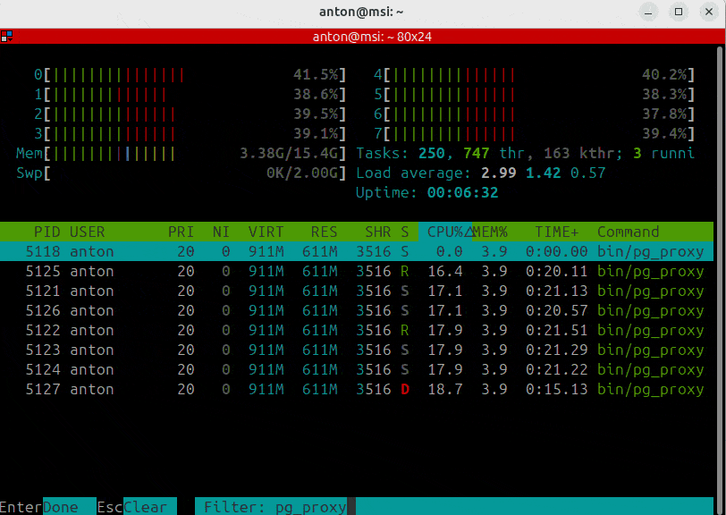
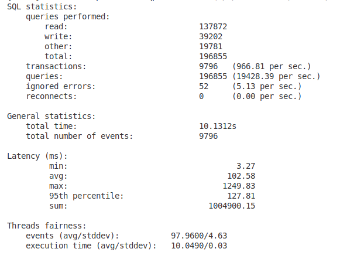

# C++ Прокси-Сервер с Поддержкой Sysbench Тестов

---

## Структура проекта
Проект включает:
- **Конфигурационный файл:** `config.json`
- **Makefile**
- **Исходный код сервера**

## Конфигурация (config.json)
Перед запуском убедитесь, что правильно настроен файл `config.json`. Ниже перечислены основные параметры:

### Параметры прокси-сервера:
| Ключ                   | Назначение                               | Пример            |
|------------------------|-------------------------------------------|-------------------|
| `port_proxy_server`    | Порт, на котором запускается сервер       | `5433`            |
| `host_pg`              | IP адрес сервера PostgreSQL               | `"127.0.0.1"`     |
| `port_pg`              | Порт PostgreSQL                           | `5432`            |
| `pg_superuser`         | Имя суперпользователя                     | `"postgres"`      |
| `pg_superuser_password`| Пароль суперпользователя                  | `"password"`      |

### Параметры Sysbench тестирования:
| Ключ                   | Назначение                               | Пример            |
|------------------------|-------------------------------------------|-------------------|
| `sysbench_threads`     | Количество одновременных потоков         | `100`               |
| `sysbench_time`        | Время теста в секундах                   | `300`             |
| `sysbench_tables`      | Кол-во тестовых таблиц                   | `4`               |
| `sysbench_table_size`  | Размер каждой таблицы                    | `100000`          |

---

## Сборка и Запуск

В проекте используется `Makefile` для управления сборкой и тестированием.

### Основные команды:

| Команда                  | Назначение                                               |
|--------------------------|-----------------------------------------------------------|
| `make help`              | Показывает описание всех целей                            |
| `make proxy_server`      | Собирает прокси-сервер                                    |
| `make sysbench_full_setup` | Подготавливает базу данных и таблицы для тестирования |
| `make sysbench_run`      | Запускает sysbench и сохраняет результаты                 |

Последовательно выполните следующие шаги:

**make proxy_server**

**make sysbench_full_setup**

**make sysbench_run**

После выполнения последней цели вы увидете статистику теста (она также запишется в resources/sysbench_result.txt)

Чтобы просмотреть логи, необходимо воспользоваться следующей командой:
*less -S resources/logs.txt*
Так как less открывает файл частями, ваш компьютер не подвиснет. 
Чтобы посмотреть записи в начале или в конце воспользуйтесь командами head и tail

## Ключевые моменты проекта:
- многопоточный epoll (6 потоков)
- асинхронный логер с отдельным потоком
- для записи используется mmap, что минимизирует нагрузку на I/O

# Результаты тестирования PostgreSQL с помощью SysBench

## Конфигурация тестового стенда
**Ноутбук:**
- **Процессор:** Intel Core i5-10200H (4 ядра, 8 потоков)
- **Оперативная память:** 16 ГБ DDR4
- **Видеокарта:** NVIDIA GeForce GTX 1650 Ti
- **Диск:** SSD

**Параметры теста:**
- Количество подключений: 100
- Длительность теста: 300 секунд (5 минут)
- Количество таблиц: 4
- Размер таблиц: 100,000 записей
- Драйвер БД: PostgreSQL

## Визуализация нагрузки
### Загрузка системы во время теста

### Итоговые результаты теста
